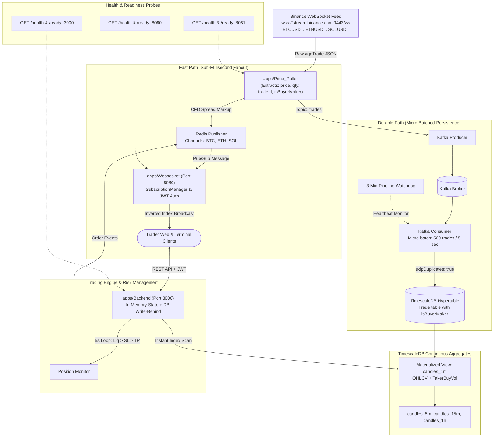

<div align="center">

# ⚡ Tradr

**Real-Time Crypto Paper Trading & AI/ML Quantitative Intelligence Platform**  
*Trade BTC, ETH, and SOL with up to 100x leverage, real broker spreads, zero floating-point drift, and institutional-grade order flow analytics.*

[](https://www.typescriptlang.org/)
[](https://bun.sh/)
[](https://redis.io/)
[](https://kafka.apache.org/)
[](https://www.timescale.com/)
[](https://www.docker.com/)
[](https://bun.sh/)

</div>

---

## 📖 Overview & Evolution

**Tradr** is a high-throughput cryptocurrency paper-trading simulation exchange and quantitative machine learning platform. Rebranded and evolved from the PaperPip architecture, Tradr introduces critical financial precision hardening, institutional-grade market data streaming, and TimescaleDB continuous aggregates.

### Key Architectural Invariants
- **Deterministic Integer Financial Math:** Floating-point numbers are strictly forbidden in accounting logic. All prices are scaled by $10^4$ and all balances are tracked in integer cents ($10^2$). Intermediate PnL multiplications execute via native JavaScript `BigInt` to eliminate IEEE-754 precision drift.
- **Asymmetric Dual-Bus Pipeline:** Incoming trades fork immediately upon ingestion into an ultra-low-latency Fast Path (Redis Pub/Sub for sub-millisecond client fanout) and a durable high-throughput persistence path (Kafka buffering $\rightarrow$ TimescaleDB micro-batching).
- **Institutional Order Flow Capture:** Unlike standard retail platforms that only capture basic OHLC, Tradr extracts Binance's `isBuyerMaker` boolean flag on every aggregate trade, pre-aggregating taker buy volume and volume imbalance directly in SQL.

---

## 📐 Trading Rules & Financial Mechanics

Tradr mirrors the exact execution mechanics and margin requirements of an institutional CFD broker:

| Parameter | Platform Specification |
| :--- | :--- |
| **Initial Paper Balance** | **$5,000.00 USD** (500,000 internal cents) |
| **Supported Markets** | `BTC/USDT`, `ETH/USDT`, `SOL/USDT` |
| **Available Leverage** | `1x`, `5x`, `10x`, `20x`, `100x` |
| **Simulated Broker Spread** | `0.05%` around Binance mid-price (configurable via `SPREAD_PERCENT`) |
| **Trading Fees** | `0.5%` of allocated margin on open, `0.5%` of margin on close |
| **Execution Prices** | Buy orders fill at **Ask** ($mid + spread$); Sell orders fill at **Bid** ($mid - spread$) |
| **Long Liquidation** | $\text{Liq}_{\text{Long}} = \text{OpenPrice} \times \frac{\text{leverage} - 1}{\text{leverage}}$ |
| **Short Liquidation** | $\text{Liq}_{\text{Short}} = \text{OpenPrice} \times \frac{\text{leverage} + 1}{\text{leverage}}$ |
| **Order Risk Controls** | Market execution with Take-Profit (TP), Stop-Loss (SL), and Trailing Stop-Loss (TSL) |

---

## 🏗️ System Architecture



---

## 🚀 Tasks Completed Till Now (Phase 1: Backend First)

The platform backend, data pipeline, and database tier have been completely ported, hardened, and verified across three major milestones:

### ✅ Milestone 01: Audit, Hardening & Trading Engine Core
- **Monorepo Foundation:** Initialized Bun workspaces with Turborepo, Docker Compose, frozen `bun.lock`, and shared packages (`@repo/shared`, `@repo/database`, `@repo/typescript-config`, `@repo/eslint-config`).
- **Initial Balance Desynchronization Fix:** Unified default user balance between database creation and in-memory store fallback to exactly **500,000 cents ($5,000.00 USD)** across `data/store.ts`, `routes/user.ts`, and `services/oauthService.ts`.
- **Middleware Pipeline Ordering Fix:** Corrected Express middleware execution sequence in `routes/trades.ts` so `authMiddleware` evaluates *before* `tradeOpenRateLimit`, preventing unauthenticated user ID bypasses.
- **Financial Math Precision Hardening:** Refactored `packages/shared/src/utils.ts` and `apps/Backend/src/utils/PnL.ts` to support Prisma `BigInt` types without integer casting errors.
- **Snapshot Storage Pruning:** Added 48-hour rolling pruning (`pruneOldSnapshots`) to prevent unbounded growth in `UserSnapshot` and `OrderSnapshot` tables.
- **API Observability:** Implemented `GET /health` and `GET /ready` endpoints in Express server.
- **Unit Testing:** 34 unit tests covering scaling utils, BigInt PnL, liquidation thresholds, and position monitor priority rules (Liquidation > SL > TP).

### ✅ Milestone 02: Streaming Ingestion & Real-Time Price Pipeline
- **Institutional `isBuyerMaker` Capture:** Updated Prisma schema and `apps/Price_Poller/src/binance.ts` to extract the `m` boolean flag from Binance aggTrades, preserving taker/maker order flow information.
- **Dual-Bus Decoupling:** Implemented Kafka producer with GZIP compression (`'trades'` topic) and Redis Pub/Sub channels (`BTC`, `ETH`, `SOL`) with symmetric broker spreads.
- **Kafka Micro-Batching & Watchdog:** Configured Kafka consumer with batch flushing (500 trades or 5-second interval) and an automated 3-minute database write watchdog that crash-restarts if Postgres ingestion freezes.
- **WebSocket Gateway:** Ported `apps/Websocket` with an inverted-index `SubscriptionManager` for $O(k)$ tick routing and HMAC JWT session authentication for per-user execution updates (`orders:{userId}`).
- **Observability:** Added HTTP `/health` and `/ready` probes to `Price_Poller` (:8081) and wrapped `Websocket` (:8080) in a native HTTP server.
- **Unit Testing:** 18 new unit tests covering raw trade parsing, spread symmetry, multiplexing, and WebSocket JWT verification.

### ✅ Milestone 03: TimescaleDB Continuous Aggregates & Historical Data
- **Continuous Aggregates Migration (`deploy/continuous-aggregates.sql`):** Created TimescaleDB continuous aggregate views (`candles_1m`, `candles_5m`, `candles_15m`, `candles_1h`) with automated real-time background refresh policies.
- **SQL-Level Taker Volume Aggregation:** Added `taker_buy_vol` pre-aggregation directly into `candles_1m` for quantitative model ingestion.
- **Asymmetric Data Retention (`deploy/retention-policy.sql`):** Configured 7-day chunk compression and 30-day raw trade auto-pruning, while retaining 1-minute aggregates for 365 days and 1-hour candles for 3 years.
- **Backend Candle Service Modernization:** Refactored `services.ts` to perform sub-millisecond indexed scans on continuous aggregate views, with an automated fallback to the raw hypertable query.
- **Historical Backfill Tooling (`scripts/backfill-historical.ts`):** Created idempotent multi-symbol Binance archive backfiller with continuous aggregate refresh support.
- **Unit Testing:** 7 new unit tests validating candle mathematical bounds (high $\ge \max(open, close)$, low $\le \min(open, close)$), volume partitioning, and parameter bounds.

---

## 🧪 Comprehensive Verification & Test Suite

Tradr maintains a rigorous unit and integration test suite executed via Bun's native test runner:

```bash
bun test apps/ packages/
```

### Current Test Suite Output: 59 Passing Tests (0 Failures)
```text
bun test v1.3.14

apps/Backend/src/services/__tests__/services.test.ts:
  ✓ TimescaleDB Candle Aggregation > should enforce candle invariants (high >= max, low <= min)
  ✓ TimescaleDB Candle Aggregation > should accurately compute taker buy volume vs maker volume
  ✓ TimescaleDB Candle Aggregation > should correctly partition multiple 1-minute buckets
  ✓ Parameter validation > should return empty array when requested start time is in future
  ✓ Parameter validation > should throw error if startTime > endTime
  ✓ Parameter validation > should throw error for unsupported symbol
  ✓ Parameter validation > should throw error for empty symbol

apps/Price_Poller/src/__tests__/ingestion.test.ts:
  ✓ Price_Poller Ingestion > should extract isBuyerMaker as true when buyer is maker (m: true)
  ✓ Price_Poller Ingestion > should extract isBuyerMaker as false when buyer is taker (m: false)
  ✓ Price_Poller Ingestion > should ignore non-aggTrade event messages
  ✓ Price_Poller Ingestion > should accurately scale prices and preserve precision

apps/Price_Poller/src/__tests__/spread.test.ts:
  ✓ Price_Poller Spread > should calculate correct bid/ask spread around mid-price
  ✓ Price_Poller Spread > should enforce minimum spread of 1 unit for ultra-low price assets
  ✓ Price_Poller Spread > should maintain exact mid-price symmetry

apps/Websocket/src/__tests__/subscription-manager.test.ts:
  ✓ WebSocket SubscriptionManager > should add clients with unique IDs and empty initial subscriptions
  ✓ WebSocket SubscriptionManager > should subscribe client to supported assets and prevent duplicates
  ✓ WebSocket SubscriptionManager > should ignore unsupported assets
  ✓ WebSocket SubscriptionManager > should unsubscribe clients cleanly from specific assets
  ✓ WebSocket SubscriptionManager > should clean up all subscriber entries on client disconnect
  ✓ WebSocket SubscriptionManager > should assign authenticated userId to client
  ✓ WebSocket SubscriptionManager > should route broadcast messages strictly to subscribed clients

apps/Websocket/src/__tests__/wsjwt.test.ts:
  ✓ WebSocket JWT Verification > should return null when token is empty or whitespace
  ✓ WebSocket JWT Verification > should return null when token is invalid or malformed
  ✓ WebSocket JWT Verification > should verify valid JWT and return userId payload
  ✓ WebSocket JWT Verification > should return null for expired JWT

packages/shared/src/__tests__/utils.test.ts:
  ✓ Shared Scaling Utilities > 6 tests passing (integer scaling roundtrips, BigInt arithmetic)

apps/Backend/src/services/__tests__/positionMonitor.test.ts:
  ✓ Position Monitor Trigger Rules > 8 tests passing (trigger priority: Liquidation > SL > TP)

apps/Backend/src/utils/__tests__/liquidation.test.ts:
  ✓ Liquidation Calculation > 10 tests passing (liquidation formulas, 1x-100x boundary invariants)

apps/Backend/src/utils/__tests__/PnL.test.ts:
  ✓ PnL Calculation > 10 tests passing (BigInt PnL arithmetic, 1x-100x leverage)

59 pass, 0 fail, 125 expect() calls across 9 files [~1.1s]
```

---

## 🗂️ Project Structure

```text
.
├── apps/
│   ├── Backend/               # REST API, trading matching & risk engine, in-memory state
│   ├── Price_Poller/          # Binance WebSocket ingest → Kafka + Redis → TimescaleDB
│   └── Websocket/             # Multiplexed WebSocket gateway (port 8080)
├── packages/
│   ├── database/              # Prisma schema, migrations, generated client
│   ├── shared/                # Price/money scaling utils, asset constants, leverage tiers
│   ├── typescript-config/     # Monorepo TypeScript configurations
│   └── eslint-config/         # Monorepo linting configurations
├── scripts/                   # Backfill scripts, historical seeders, watch utilities
├── deploy/                    # TimescaleDB continuous aggregates & retention policies
├── .github/
│   └── workflows/
│       └── ci-backend.yml     # Automated CI running bun test on push/PR
├── docker-compose.yml         # Local development services (Postgres/Timescale, Kafka, Redis)
├── docker-compose.prod.yml    # Full production container stack
├── package.json               # Monorepo root workspaces
└── bun.lock                   # Frozen dependency lockfile
```

---

## 🛠️ Local Development & Quick Start

### 1. Prerequisites
- [Bun](https://bun.sh) (v1.3+)
- [Docker](https://www.docker.com/) & Docker Compose
- Node.js (>=18)

### 2. Install Dependencies
```bash
bun install
```

### 3. Spin Up Infrastructure
```bash
docker compose up -d
```
Starts TimescaleDB (PostgreSQL 16), Apache Kafka + Zookeeper, and Redis.

### 4. Database Setup & Migrations
```bash
# Generate Prisma Client
bun run prisma generate

# Apply Migrations
bun run prisma migrate dev

# Apply TimescaleDB Continuous Aggregates & Retention Policies
docker exec -i exness_db psql -U exness_user -d exness_trades < deploy/continuous-aggregates.sql
docker exec -i exness_db psql -U exness_user -d exness_trades < deploy/retention-policy.sql

# Seed Initial Historical Data
bun run seed-data
```

### 5. Start Development Services
Run each service in parallel or via separate terminal windows:
```bash
# Start Backend API (Port 3000)
cd apps/Backend && bun run dev

# Start Price Poller Ingestion
cd apps/Price_Poller && bun run dev

# Start WebSocket Gateway (Port 8080)
cd apps/Websocket && bun run dev
```

---

## 🗺️ Master Development Roadmap

- [x] **Phase 1: Backend First (Completed)**
  - [x] Milestone 01: Audit, Hardening & Trading Engine Core
  - [x] Milestone 02: Streaming Ingestion & Real-Time Price Pipeline
  - [x] Milestone 03: TimescaleDB Continuous Aggregates & Historical Data
- [ ] **Phase 2: ML + AI Engine (Next Up)**
  - [ ] Milestone 04: ML Foundations, Python Workspace & TimescaleDB Data Pipeline
  - [ ] Milestone 05: Feature Engineering & Versioned Feature Registry
  - [ ] Milestone 06: Labels & Leak-Free Dataset Builder
  - [ ] Milestone 07: Backtesting & Strategy Evaluation Framework
  - [ ] Milestone 08: Core Predictive Models (Direction & Volatility)
  - [ ] Milestone 09: FastAPI Inference Service & Backend Integration
  - [ ] Milestone 10: Real-Time Liquidation Risk Intelligence
  - [ ] Milestone 11: Real-Time Market Anomaly Detection
  - [ ] Milestone 12: Trader Behavior Analytics & LLM Coach
  - [ ] Milestone 13: Crypto News Sentiment NLP Engine
  - [ ] Milestone 14: Automated MLOps Retraining Loop & Drift Monitoring
  - [ ] Milestone 15: Reinforcement Learning Trading Agent (PPO/DQN)
- [ ] **Phase 3: Frontend Last**
  - [ ] Milestone 16: React 19 Trading Terminal & AI Intelligence UI

---

## 🛡️ License

Private & Proprietary.
