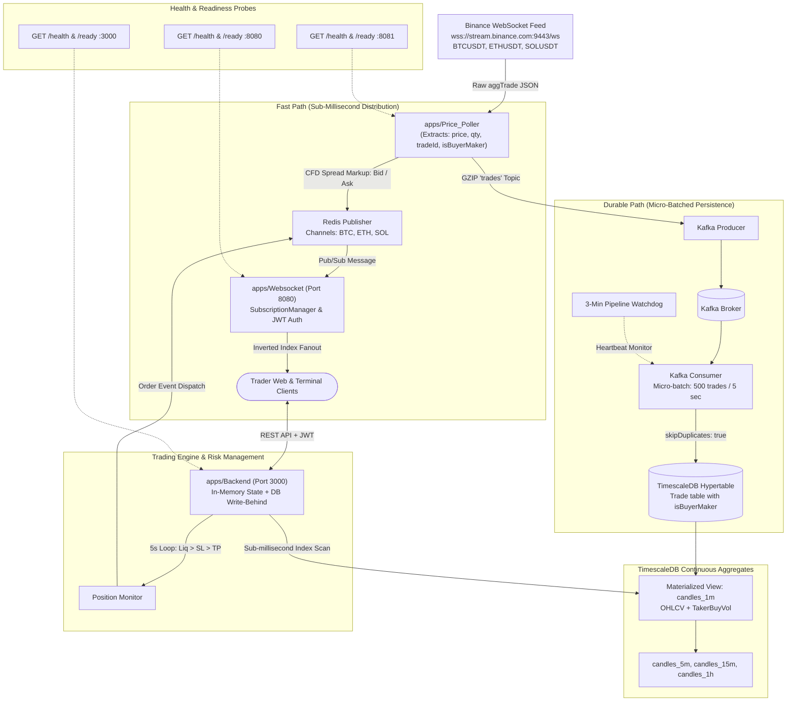

<div align="center">

# ⚡ Tradr

**High-Throughput Real-Time Cryptocurrency Paper-Trading Exchange & Quantitative Intelligence Engine**

*Trade BTC, ETH, and SOL with up to 100x leverage, institutional CFD spreads, zero floating-point drift, and microsecond-level tick distribution.*

[](https://www.typescriptlang.org/)
[](https://bun.sh/)
[](https://redis.io/)
[](https://kafka.apache.org/)
[](https://www.timescale.com/)
[](https://www.docker.com/)
[](https://github.com/Vedant1521/tradr/actions)
[](https://bun.sh/)

</div>

---

## 📖 Executive Summary

**Tradr** is a distributed, event-driven cryptocurrency paper-trading simulation platform designed to emulate institutional CFD exchange mechanics. Engineered from the ground up for strict financial precision, low latency, and high concurrency, Tradr combines live Binance market feeds, an asymmetric dual-bus streaming pipeline, real-time TimescaleDB continuous aggregation, and an automated risk engine with real-time liquidation monitoring.

Unlike naive simulators that rely on floating-point arithmetic and single-threaded polling, Tradr enforces **deterministic integer financial math**, captures **full maker/taker order flow dynamics**, and splits price distribution into an ultra-low-latency fanout tier and a durable persistence layer.

---

## ✨ Key Architectural Highlights

- **Deterministic BigInt Financial Accounting:** Floating-point numbers are strictly forbidden in accounting logic. All asset prices are scaled by $10^4$ and balances are tracked in integer cents ($10^2$). All PnL multiplications execute via native JavaScript `BigInt` to eliminate IEEE-754 precision drift.
- **Asymmetric Dual-Bus Pipeline:** Incoming live trades from Binance aggregate feeds fork immediately into:
  - **Fast Path:** Redis Pub/Sub applying real broker bid/ask spreads for sub-millisecond client broadcasts.
  - **Durable Path:** GZIP-compressed Kafka stream buffering trades for micro-batched persistence into TimescaleDB hypertables.
- **Institutional Order Flow Capture:** Extracts Binance's `isBuyerMaker` flag on every raw trade, enabling SQL-level pre-aggregation of taker buy volume, trade frequency, and directional volume imbalance.
- **Automated TimescaleDB Continuous Aggregates:** Automated real-time materialized views (`candles_1m`, `candles_5m`, `candles_15m`, `candles_1h`) with intelligent fallback querying and multi-tier retention policies (30-day raw trade pruning with multi-year aggregate preservation).
- **Sub-Millisecond Tick Routing:** Dedicated WebSocket gateway utilizing an inverted-index `SubscriptionManager` ($O(k)$ delivery per tick where $k$ is the number of subscribed clients) and HMAC JWT authenticated private user event streams.
- **Continuous Position & Risk Monitor:** 5-second asynchronous risk assessment loop enforcing strict execution precedence: **Liquidation > Stop-Loss (SL) > Take-Profit (TP) > Trailing Stop-Loss (TSL)**.

---

## 📐 Trading Rules & Execution Mechanics

Tradr accurately models the order execution and margin dynamics of professional leveraged CFD trading:

| Parameter | Platform Specification |
| :--- | :--- |
| **Initial Paper Balance** | **$5,000.00 USD** (500,000 internal cents) |
| **Supported Markets** | `BTC/USDT`, `ETH/USDT`, `SOL/USDT` |
| **Available Leverage** | `1x`, `5x`, `10x`, `20x`, `100x` |
| **Simulated Broker Spread** | `0.05%` around Binance mid-price (configurable via `SPREAD_PERCENT`) |
| **Trading Fees** | `0.5%` of margin on position open, `0.5%` on position close |
| **Execution Prices** | Buy orders fill at **Ask** ($mid + spread$); Sell orders fill at **Bid** ($mid - spread$) |
| **Order Risk Controls** | Market orders, Take-Profit (TP), Stop-Loss (SL), and dynamic Trailing Stop-Loss (TSL) |
| **Position Adjustments** | Add margin dynamically to lower effective leverage and push out liquidation thresholds |

### Mathematical Formulations

#### 1. Integer Financial Scaling
$$\text{ScaledPrice} = \text{round}(\text{Price} \times 10{,}000)$$
$$\text{ScaledUSD} = \text{round}(\text{USD} \times 100)$$

#### 2. Position PnL (Integer Cents)
$$\text{PnLCents}_{\text{Long}} = \left\lfloor \frac{\text{MarginCent} \times \text{Leverage} \times (\text{ClosePrice} - \text{OpenPrice})}{\text{OpenPrice}} \right\rfloor$$

$$\text{PnLCents}_{\text{Short}} = \left\lfloor \frac{\text{MarginCent} \times \text{Leverage} \times (\text{OpenPrice} - \text{ClosePrice})}{\text{OpenPrice}} \right\rfloor$$

#### 3. Liquidation Price Calculation
$$\text{LiqPrice}_{\text{Long}} = \text{OpenPrice} \times \frac{\text{Leverage} - 1}{\text{Leverage}}$$

$$\text{LiqPrice}_{\text{Short}} = \text{OpenPrice} \times \frac{\text{Leverage} + 1}{\text{Leverage}}$$

---

## 🏗️ System Architecture



---

## 🗂️ Repository Structure

Tradr is structured as a high-performance monorepo powered by Bun workspaces:

```text
.
├── apps/
│   ├── Backend/               # Express REST API, trade execution, margin & risk engine
│   ├── Price_Poller/          # Binance WebSocket ingestion, Kafka producer, Redis publisher
│   └── Websocket/             # High-concurrency WebSocket gateway (Port 8080)
├── packages/
│   ├── database/              # Prisma ORM schema, migrations, generated client
│   ├── shared/                # BigInt financial scaling utilities, trading constants
│   ├── typescript-config/     # Shared compiler configurations
│   └── eslint-config/         # Shared code linting configurations
├── deploy/                    # TimescaleDB continuous aggregates & data retention policies
├── scripts/                   # Historical data backfill and database management utilities
├── .github/
│   └── workflows/
│       └── ci-backend.yml     # Automated CI pipeline running unit & regression tests
├── docker-compose.yml         # Containerized local services (TimescaleDB, Kafka, Redis)
├── docker-compose.prod.yml    # Full-stack production container deployment
├── package.json               # Root monorepo configuration & workspace definitions
└── bun.lock                   # Frozen dependency lockfile
```

---

## 🧪 Quality Assurance & Test Suite

The platform is backed by a comprehensive unit and regression testing suite covering mathematical invariants, order routing, and authentication:

```bash
bun test apps/ packages/
```

### Verification Matrix (59 Passing Tests, 0 Failures)

```text
bun test v1.3.14

apps/Backend/src/services/__tests__/services.test.ts:
  ✓ TimescaleDB Candle Aggregation > should enforce candle invariants (high >= max, low <= min)
  ✓ TimescaleDB Candle Aggregation > should accurately compute taker buy volume vs maker volume
  ✓ TimescaleDB Candle Aggregation > should correctly partition multiple 1-minute buckets
  ✓ Parameter validation > should return empty array when requested start time is in future
  ✓ Parameter validation > should throw error if startTime > endTime
  ✓ Parameter validation > should throw error for unsupported symbol
  ✓ Parameter validation > should throw error for empty symbol

apps/Price_Poller/src/__tests__/ingestion.test.ts:
  ✓ Price_Poller Ingestion > should extract isBuyerMaker as true when buyer is maker (m: true)
  ✓ Price_Poller Ingestion > should extract isBuyerMaker as false when buyer is taker (m: false)
  ✓ Price_Poller Ingestion > should ignore non-aggTrade event messages
  ✓ Price_Poller Ingestion > should accurately scale prices and preserve precision

apps/Price_Poller/src/__tests__/spread.test.ts:
  ✓ Price_Poller Spread > should calculate correct bid/ask spread around mid-price
  ✓ Price_Poller Spread > should enforce minimum spread of 1 unit for ultra-low price assets
  ✓ Price_Poller Spread > should maintain exact mid-price symmetry

apps/Websocket/src/__tests__/subscription-manager.test.ts:
  ✓ WebSocket SubscriptionManager > should add clients with unique IDs and empty initial subscriptions
  ✓ WebSocket SubscriptionManager > should subscribe client to supported assets and prevent duplicates
  ✓ WebSocket SubscriptionManager > should ignore unsupported assets
  ✓ WebSocket SubscriptionManager > should unsubscribe clients cleanly from specific assets
  ✓ WebSocket SubscriptionManager > should clean up all subscriber entries on client disconnect
  ✓ WebSocket SubscriptionManager > should assign authenticated userId to client
  ✓ WebSocket SubscriptionManager > should route broadcast messages strictly to subscribed clients

apps/Websocket/src/__tests__/wsjwt.test.ts:
  ✓ WebSocket JWT Verification > should return null when token is empty or whitespace
  ✓ WebSocket JWT Verification > should return null when token is invalid or malformed
  ✓ WebSocket JWT Verification > should verify valid JWT and return userId payload
  ✓ WebSocket JWT Verification > should return null for expired JWT

packages/shared/src/__tests__/utils.test.ts:
  ✓ Shared Scaling Utilities > 6 tests passing (integer scaling roundtrips, BigInt arithmetic)

apps/Backend/src/services/__tests__/positionMonitor.test.ts:
  ✓ Position Monitor Trigger Rules > 8 tests passing (trigger priority: Liquidation > SL > TP)

apps/Backend/src/utils/__tests__/liquidation.test.ts:
  ✓ Liquidation Calculation > 10 tests passing (liquidation formulas, 1x-100x boundary invariants)

apps/Backend/src/utils/__tests__/PnL.test.ts:
  ✓ PnL Calculation > 10 tests passing (BigInt PnL arithmetic, 1x-100x leverage)

59 pass, 0 fail, 125 expect() calls across 9 files [~1.1s]
```

---

## 🚀 Quick Start Guide

### 1. Prerequisites
- [Bun](https://bun.sh) (v1.3+)
- [Docker](https://www.docker.com/) & Docker Compose
- Node.js (>=18)

### 2. Install Dependencies
```bash
bun install
```

### 3. Spin Up Infrastructure
```bash
docker compose up -d
```
Starts TimescaleDB (PostgreSQL 16), Apache Kafka + Zookeeper, and Redis.

### 4. Database Setup & Continuous Aggregates
```bash
# Generate Prisma Client
bun run prisma generate

# Apply Migrations
bun run prisma migrate dev

# Apply TimescaleDB Continuous Aggregates & Retention Policies
docker exec -i tradr_db psql -U user -d trades_db < deploy/continuous-aggregates.sql
docker exec -i tradr_db psql -U user -d trades_db < deploy/retention-policy.sql

# Seed Initial Historical Data
bun run seed-data
```

### 5. Start Development Services
Run each service in parallel or via separate terminal sessions:

```bash
# Start Backend Trading API (Port 3000)
cd apps/Backend && bun run dev

# Start Price Poller Ingestion & Feed Engine
cd apps/Price_Poller && bun run dev

# Start WebSocket Gateway (Port 8080)
cd apps/Websocket && bun run dev
```

---

## 📡 API & Protocol Overview

### REST Endpoints (`apps/Backend` :3000)
- `POST /api/v2/user/signup` — Register paper trading account ($5,000 starting balance)
- `POST /api/v2/user/signin` — Authenticate and receive JWT session bearer token
- `GET /api/v2/user/balance` — Retrieve current cash balance and unrealized PnL
- `POST /api/v2/trade/order` — Open market position (Symbol, Margin, Leverage, Side, TP, SL, TSL)
- `POST /api/v2/trade/close` — Close active position at current market price
- `POST /api/v2/trade/cancel` — Cancel pending limit/trigger order
- `POST /api/v2/trade/update-sl-tp` — Modify Stop-Loss or Take-Profit thresholds dynamically
- `POST /api/v2/trade/add-margin` — Add margin to an active position to lower liquidation risk
- `GET /api/v2/trade/candle` — Query high-speed historical OHLCV candles
- `GET /health` & `GET /ready` — Infrastructure health and readiness probes

### Real-Time WebSocket Protocol (`apps/Websocket` :8080)
- **Authenticate:** Send `{ "type": "AUTH", "token": "<JWT>" }` to link the connection to your trader account for live order fills and liquidation alerts.
- **Subscribe to Prices:** Send `{ "type": "SUBSCRIBE", "assets": ["BTC", "ETH", "SOL"] }` to receive sub-millisecond price ticks formatted with simulated broker spreads.
- **Unsubscribe:** Send `{ "type": "UNSUBSCRIBE", "assets": ["SOL"] }`.

---

## 🛡️ License

Private & Proprietary. All rights reserved.
